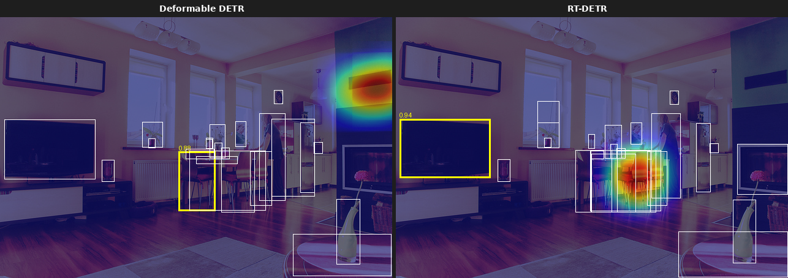
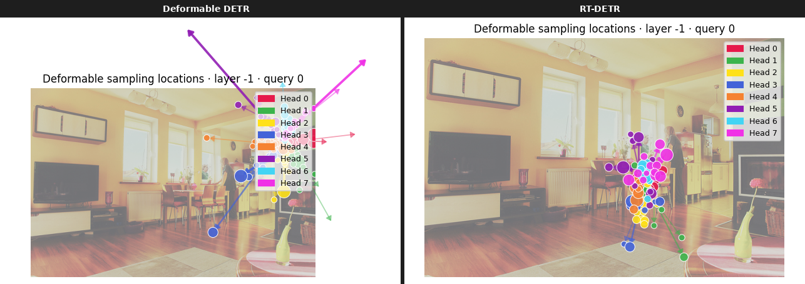
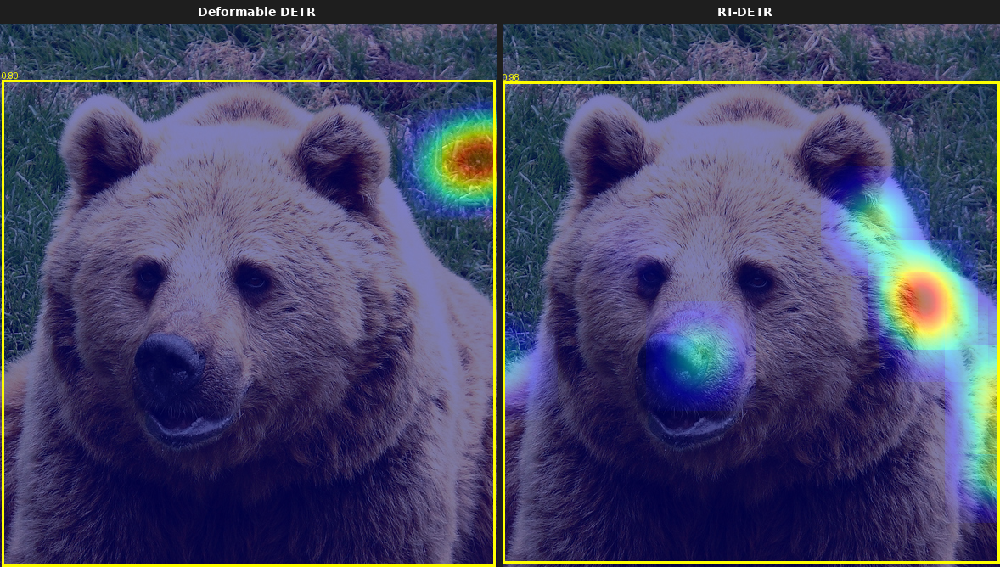
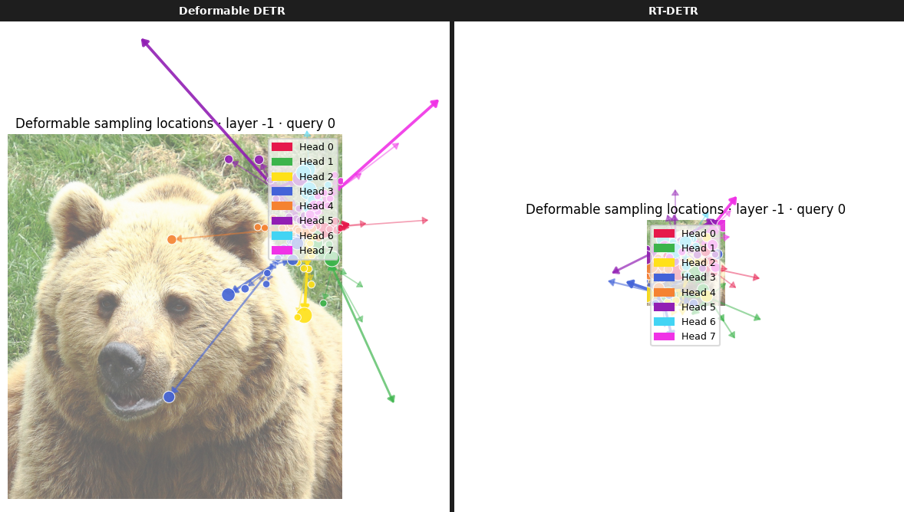
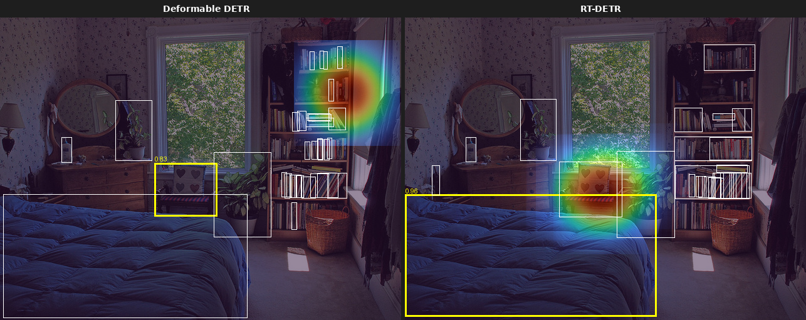
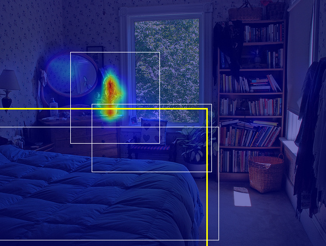
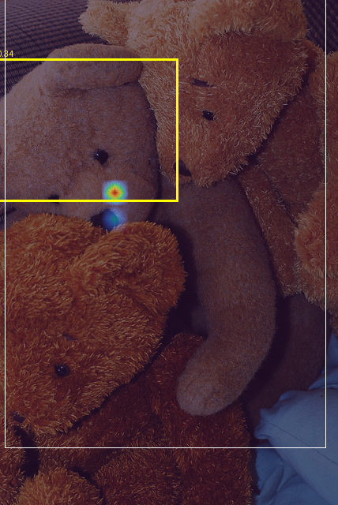
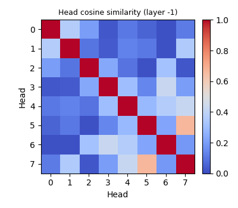

# detr-lens
Interactive attention visualization toolkit for **Deformable DETR**, **RT-DETR**, and **DAB-DETR**.
Drop any image into the web app and compare attention maps side-by-side across all three models, including a unique mode for visualizing deformable sampling offsets as directional arrows on the image.

---

## Models
| Model | Checkpoint | Attention type |
|-------|-----------|----------------|
| **Deformable DETR** | `SenseTime/deformable-detr` | Multi-scale deformable |
| **RT-DETR** | `PekingU/rtdetr_r50vd` | Multi-scale deformable |
| **DAB-DETR** | `IDEA-Research/dab-detr-resnet-50` | Standard dense |

### Dense vs deformable attention
Deformable DETR and RT-DETR predict a small set of **sampling locations** (typically 4 points x 4 scales x 8 heads = 128 total) per query. Each head looks only at these sparse positions, a key innovation that makes attention efficient for high-resolution feature maps.

DAB-DETR uses **standard dense cross-attention**: every query attends to *all* H×W encoder positions simultaneously (shape `(bs, n_heads, n_queries, H_feat × W_feat)`). This is the original Transformer attention formulation, without the sparsity constraint.

This architectural difference is why the **Sampling Offsets** visualization only works for Deformable DETR and RT-DETR. For DAB-DETR, spatial heatmaps are produced by reshaping the flat `seq_len` attention dimension back to `(H_feat, W_feat)` directly, with no Gaussian splatting needed.

---

## Features
| Mode | Description |
|------|-------------|
| **Attention Heatmap** | Cross-attention weights overlaid as a color heatmap. Supports per-layer, per-head, and head-averaged views. Dense attention (DAB-DETR) is reshaped directly to spatial; deformable attention is splatted with Gaussian kernels at sampling locations. |
| **Deformable Sampling Offsets** | Available for Deformable DETR and RT-DETR only. Shows where in the image each attention head is actually looking, rendered as colored dots and arrows radiating from the query centroid. One color per head. |
| **Attention Rollout** | Accumulates attention across all decoder layers using the residual rollout method. Gives a holistic view of what each query aggregates from the encoder. |
| **Head Diversity** | Pairwise cosine-similarity heatmap between all attention heads in a layer. Low similarity = heads are specialized. |
| **Side-by-Side** | Compare two model outputs (heatmap / offsets / rollout) side-by-side for the same image and query. |
| **Compare all three** | Run Deformable DETR, RT-DETR, and DAB-DETR on the same image and show their heatmaps in a single 3-column panel. |

---

## Installation
```bash
# Clone the repo
git clone https://github.com/Samwise-Potato-Gamgee/detr-lens.git
cd detr-lens

# Create venv (Python 3.12 required)
python3.12 -m venv .venv
source .venv/bin/activate

# Install PyTorch (CUDA 12.4)
pip install torch torchvision --index-url https://download.pytorch.org/whl/cu124

# Install remaining dependencies
pip install -r requirements.txt

# Download COCO val2017 (optional, needed for built-in examples)
mkdir -p data/coco && cd data/coco
wget http://images.cocodataset.org/zips/val2017.zip
wget http://images.cocodataset.org/annotations/annotations_trainval2017.zip
unzip val2017.zip && unzip annotations_trainval2017.zip
```

Model weights are downloaded automatically from HuggingFace Hub on first use:
- **Deformable DETR**: `SenseTime/deformable-detr`
- **RT-DETR**: `PekingU/rtdetr_r50vd`
- **DAB-DETR**: `IDEA-Research/dab-detr-resnet-50`

---

## Launch the App
```bash
python app.py
```

Opens at `http://localhost:7860`. Upload any image or click one of the COCO examples.

### Controls
| Control | Description |
|---------|-------------|
| **Model** | Deformable DETR, RT-DETR, DAB-DETR, Both (Deformable DETR vs RT-DETR side-by-side), or Compare all three |
| **Visualization mode** | Heatmap / Sampling Offsets / Rollout / Head Diversity / Side-by-Side. Note: Sampling Offsets is only available for Deformable DETR and RT-DETR. |
| **Decoder layer** | Negative index: -1 = last (most refined), -6 = first |
| **Attention head** | All (average) or a specific head index |
| **Object query index** | Which of the 300 object queries to visualize. Queries are not sorted by confidence, so try different indices to find active detections. |
| **Colormap** | jet, turbo, viridis, plasma, hot, coolwarm |
| **Heatmap opacity** | Blend strength of the attention overlay |

---

## CLI Tools

### compare.py - batch visualization
Runs all visualization modes on a folder of images and saves PNGs to `results/`.

```bash
# Run RT-DETR on first 20 images in the COCO val set
python compare.py --input data/coco/val2017 --model rt-detr --n 20

# Run DAB-DETR
python compare.py --input data/coco/val2017 --model dab-detr --n 10 --output results/

# Run both deformable models
python compare.py --input data/coco/val2017 --model both --n 10 --output results/

# All options
python compare.py \
    --input  <folder or image>   # required
    --model  rt-detr|deformable-detr|dab-detr|both  (default: both)
    --output results/            # output directory
    --n      20                  # max images
    --layer  -1                  # decoder layer index
    --query  0                   # object query index
    --head   None                # head index (default: average)
```

### export.py - publication-quality export
Exports PNGs at 300 DPI and optional animated GIFs sweeping all decoder layers.

```bash
# Export 5 images at 300 DPI
python export.py --input data/coco/val2017 --n 5 --dpi 300 --output exports/

# Also export animated GIFs (layers sweep)
python export.py --input data/coco/val2017 --n 5 --gif --gif-mode heatmap --output exports/

# All options
python export.py \
    --input  <folder or image>
    --model  rt-detr|deformable-detr|dab-detr|both  (default: both)
    --output exports/
    --n      5
    --dpi    300
    --layer  -1
    --query  0
    --gif                        # also save animated GIFs
    --gif-mode heatmap|rollout|offsets
```

---

## Visualization Modes - Details

### Attention Heatmap
Cross-attention weights are extracted per decoder layer and head via `register_forward_hook`. For deformable attention models, the weights have shape `(n_queries, n_heads, n_levels, n_points)`. We splat each sampling point onto the image canvas with a Gaussian kernel weighted by its attention value, producing a smooth spatial heatmap.

### Deformable Sampling Offsets
The key insight of Deformable DETR (and RT-DETR) is that instead of attending to all encoder positions, each query predicts a small set of reference points (sampling locations) in image space. These locations are extracted via a `register_forward_pre_hook` on the inner CUDA multi-scale deformable attention op, capturing the `(bs, n_queries, n_heads, n_levels, n_points, 2)` normalized coordinate tensor before the weighted aggregation.

Each head gets a distinct color. Dot sizes reflect attention weight. Arrows radiate from the per-head centroid to each sampling point, showing the reach of each head.

### Attention Rollout
Iterates across all decoder layers, accumulating attention maps using residual rollout:
```
A_rollout = 0.5 * I + 0.5 * A_layer
rollout    = rollout ⊗ A_rollout  (normalized)
```
This gives a view of the full decoder stack's receptive field for a given query.

### Head Diversity
Computes pairwise cosine similarity between all heads' flattened attention vectors in a given layer. Lower similarity = heads are more specialized. The scalar mean off-diagonal similarity is reported in the UI status line.

---

## Examples

### Deformable DETR vs RT-DETR (side-by-side comparisons on COCO val2017)

#### Image 000000000139 - Heatmap


#### Image 000000000139 - Sampling Offsets


#### Image 000000000285 - Heatmap


#### Image 000000000285 - Sampling Offsets


#### Image 000000000632 - Rollout


### DAB-DETR examples (dense attention, no sampling offsets)

#### Image 000000000632 - DAB-DETR Heatmap
Cross-attention weights reshaped directly from `(25x34)` feature-map resolution to image size via bilinear interpolation, no splatting needed.


#### Image 000000000776 - DAB-DETR Rollout
Residual rollout accumulated across all 6 decoder layers.


#### Image 000000000872 - DAB-DETR Head Diversity
Pairwise cosine similarity between the 8 cross-attention heads in the last decoder layer.


---

## Project Structure
```
detr-lens/
├── app.py                   # Gradio web app
├── compare.py               # Batch visualization CLI
├── export.py                # Publication-quality export CLI
├── requirements.txt
├── models/
│   ├── deformable_detr.py   # Hook-based Deformable DETR wrapper
│   ├── rtdetr.py            # Hook-based RT-DETR wrapper
│   └── dab_detr.py          # Hook-based DAB-DETR wrapper (dense attention)
├── extractors/
│   ├── cross_attn.py        # Cross-attention extraction (deformable)
│   ├── self_attn.py         # Self-attention extraction utilities
│   ├── deformable_offsets.py# Sampling location extraction (deformable)
│   └── dense_attn.py        # Cross-attention extraction (dense/DAB-DETR)
├── viz/
│   ├── heatmap.py           # Heatmap + rollout + head diversity (both attn types)
│   ├── heatmap_utils.py     # Gaussian splatting helper
│   ├── offset_grid.py       # Sampling offset arrow visualization
│   └── side_by_side.py      # Dual-model comparison panels
├── data/coco/               # COCO val2017 images + annotations
├── examples/                # Pre-generated example outputs
└── notebooks/
    └── exploration.ipynb    # Interactive exploration notebook
```

---

## Hardware Requirements
Designed for a single **RTX 4060 Ti (8-16 GB)**. Inference only, no training. All three models fit comfortably in VRAM simultaneously. If you hit memory limits, load one model at a time via the app's model selector.

---

## Technical Notes
- All hook registration is non-invasive, meaning model weights and architecture are never modified.
- Deformable DETR / RT-DETR: sampling locations are captured via `register_forward_pre_hook` on the inner `MultiScaleDeformableAttention` CUDA op, which receives them as a positional argument.
- DAB-DETR: cross-attention weights `(bs, n_heads, n_queries, H_feat × W_feat)` are captured via `register_forward_hook` on each `DabDetrDecoderLayerCrossAttention` module; the backbone hook captures `(H_feat, W_feat)` so the flat sequence can be reshaped to a spatial grid.
- No `cv2` dependency, all image I/O and rendering uses PIL and matplotlib.
- Python 3.12 · PyTorch 2.x · transformers >= 4.40 · Gradio 4+
